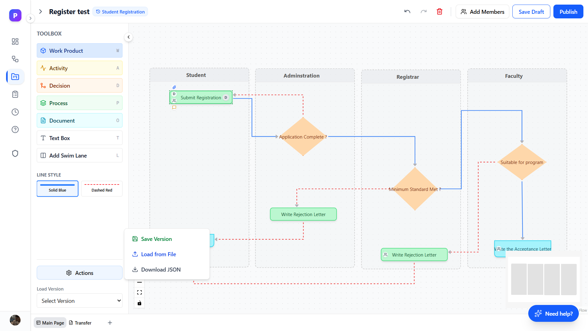

# Pluto 🚀

Pluto is a specialized platform designed for modeling, managing, and executing Functional Safety (FuSa) processes compliant with standards like ISO 26262. It provides a bridge between high-level process design and project-level execution.

 *Link to a demo or screenshot*

## ✨ Core Features

### 1. Visual Process Modeling
- **Drag-and-Drop Canvas**: Powered by React Flow for intuitive workflow design.
- **FuSa Node Types**: Specialized nodes for Work Products (Blue), Activities (Yellow), Decisions (Orange), and Processes (Green).
- **Swimlanes**: Organize activities by departments or lifecycles.
- **Multi-Sheet Support**: Handle complex workflows across multiple tabs.

### 2. Project Management & Governance
- **Process Versioning**: Create snapshots and manage versions of your safety processes.
- **Instantiation**: Clone process versions into active projects for team execution.
- **Role-Based Access Control (RBAC)**: Fine-grained permissions (Admin, Editor, Viewer).
- **Collaboration**: Real-time project sharing and collaborator management.

### 3. Monitoring & Documentation
- **Centralized Dashboards**: Overviews for both process templates and active projects.
- **Global Calendar**: Automatic aggregation of deadlines and tasks.
- **Export Capabilities**: High-quality exports to PNG and PDF for documentation and audits.

---

## 🛠️ Tech Stack

- **Frontend**: [Next.js](https://nextjs.org/) (App Router), [React](https://reactjs.org/), [Tailwind CSS](https://tailwindcss.com/), [Shadcn UI](https://ui.shadcn.com/), [React Flow](https://reactflow.dev/).
- **Backend**: [FastAPI](https://fastapi.tiangolo.com/) (Python 3.11), [Pydantic](https://docs.pydantic.dev/).
- **Database**: [Supabase](https://supabase.com/) (PostgreSQL + RLS).
- **Authentication**: [Clerk](https://clerk.com/).
- **Containerization**: [Docker](https://www.docker.com/).

---

## 🚀 Getting Started

### Prerequisites
- Docker & Docker Desktop
- Node.js 18+ (for local dev)
- Python 3.11+ (for local dev)

### 🐋 Running with Docker (Recommended)

1. **Clone the repository**:
   ```bash
   git clone https://github.com/yourusername/Pluto.git
   cd Pluto
   ```

2. **Setup Environment Variables**:
   Create `.env` files in both the `frontend/` and `backend/` directories.

   **`backend/.env`**:
   ```env
   SUPABASE_URL=your_supabase_url
   SUPABASE_KEY=your_supabase_anon_key
   FRONTEND_URL=http://localhost:3000

   # Jira Integration (Optional)
   JIRA_URL=https://your-domain.atlassian.net
   JIRA_EMAIL=your-email@example.com
   JIRA_API_TOKEN=your-jira-api-token
   JIRA_PROJECT_KEY=PROJ
   ```

   **`frontend/.env`**:
   ```env
   NEXT_PUBLIC_CLERK_PUBLISHABLE_KEY=your_clerk_pub_key
   CLERK_SECRET_KEY=your_clerk_secret_key
   NEXT_PUBLIC_CLERK_SIGN_IN_URL=/sign-in
   NEXT_PUBLIC_CLERK_SIGN_UP_URL=/sign-up
   NEXT_PUBLIC_API_URL=http://localhost:8000
   NEXT_PUBLIC_JIRA_URL=https://your-domain.atlassian.net
   ```

3. **Build and Run**:
   ```bash
   docker-compose up --build
   ```

4. **Access the App**:
   - **Frontend**: [http://localhost:3000](http://localhost:3000)
   - **Backend API Docs**: [http://localhost:8000/docs](http://localhost:8000/docs)

---

## 📂 Project Structure

```text
Pluto/
├── backend/            # FastAPI Server
│   ├── main.py         # Entry point & API routes
│   ├── models.py       # Pydantic data models
│   ├── database.py     # Supabase client setup
│   └── Dockerfile      # Backend container config
├── frontend/           # Next.js Application
│   ├── app/            # App Router pages and layouts
│   ├── components/     # UI components (Radix, Lucide, Custom Nodes)
│   ├── context/        # Process and Role contexts
│   └── Dockerfile      # Frontend container config
└── docker-compose.yml  # Orchestration for both services
```

---

## 🛠️ Local Development (Manual)

### Backend
1. Go to `backend` folder.
2. Create a virtual environment: `python -m venv venv`.
3. Activate it: `source venv/bin/activate` (or `venv\Scripts\activate` on Windows).
4. Install requirements: `pip install -r requirements.txt`.
5. Run server: `uvicorn main:app --reload`.

### Frontend
1. Go to `frontend` folder.
2. Install dependencies: `npm install`.
3. Run development server: `npm run dev`.

---

## 🛡️ License
Distributed under the MIT License. See `LICENSE` for more information.
